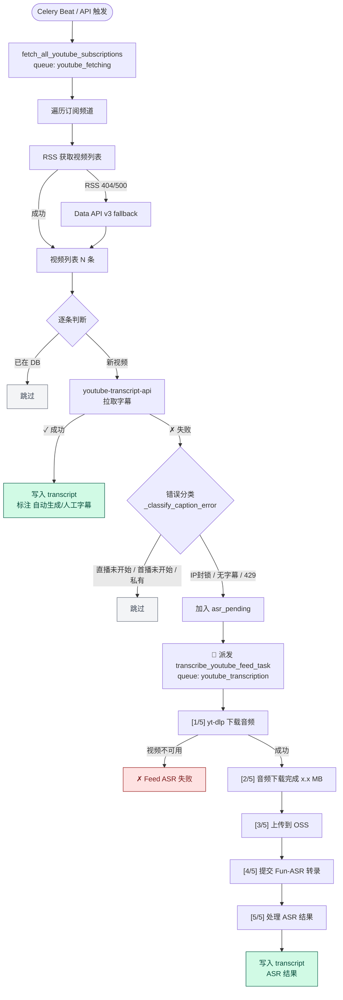

# Local Virtual Service — YouTube 转录独立 Worker

将 YouTube 视频获取、字幕拉取、yt-dlp 音频下载和 Fun-ASR 语音识别打包为**独立可部署的 Celery Worker**，部署在家庭网络虚拟机上，解决远程服务器无法直接访问 YouTube 的问题。

## 架构

```
┌──────────────────────────────────────────┐
│           远程服务器 (43.99.37.76)         │
│  ┌─────────┐  ┌───────┐  ┌───────────┐  │
│  │ Web API  │  │ Redis │  │PostgreSQL │  │
│  │Scheduler │  │Broker │  │  Database │  │
│  └────┬─────┘  └───┬───┘  └─────┬─────┘  │
│       │ dispatch    │            │        │
└───────┼─────────────┼────────────┼────────┘
        │             │            │
   ─ ─ ─│─ ─ ─ ─ ─ ─ ┼ ─ ─ ─ ─ ─ ┼ ─ ─ ─ ─  公网
        │             │            │
┌───────┼─────────────┼────────────┼────────┐
│       ▼             ▼            ▼        │
│  ┌──────────────────────────────────────┐ │
│  │   YouTube Transcription Worker       │ │
│  │                                      │ │
│  │  youtube_fetching 队列:              │ │
│  │    ├ RSS/API 获取频道视频列表         │ │
│  │    ├ youtube-transcript-api 字幕     │ │
│  │    └ 字幕失败 → 自动派发 ASR ──┐     │ │
│  │                                │     │ │
│  │  youtube_transcription 队列:   │     │ │
│  │    (Main Worker, concurrency=2)│     │ │
│  │    ├ yt-dlp 下载音频 ◄─────────┘     │ │
│  │    ├ 探测时长 > 30min ─┐             │ │
│  │    ├ OSS 上传 → Fun-ASR 转录         │ │
│  │    └ 结果写回数据库        │         │ │
│  │                            ▼         │ │
│  │  youtube_transcription_long 队列     │ │
│  │    (Long Worker, concurrency=1)      │ │
│  │    └ 大文件专用, 不阻塞短视频         │ │
│  └──────────────────────────────────────┘ │
│          家庭虚拟机 (可访问 YouTube)        │
└───────────────────────────────────────────┘
```

## 流程

从远程服务器派发一条 `fetch_all_youtube_subscriptions` 任务，到最终 transcript 写回数据库，整个处理链路如下：



### 各阶段对应的关键日志

| 阶段 | 所在队列 | 日志特征 |
|------|---------|---------|
| 批量任务开始 / 结束 | `youtube_fetching` | `══ 批量获取开始/完成 ══` |
| 单频道 RSS 拉取 | `youtube_fetching` | `── [N/M] 频道: xxx ──`、`RSS 返回 N 个视频` |
| RSS fallback | `youtube_fetching` | `RSS 失败, 尝试 Data API v3 fallback` |
| 新视频字幕抓取 | `youtube_fetching` | `[新] video=xxx「title」`、`✓ 字幕获取成功: lang=xx(自动生成/人工字幕)` |
| 字幕失败分类 | `youtube_fetching` | `✗ 字幕获取失败: 原因=xxx [→ ASR / 跳过]` |
| ASR 降级派发 | `youtube_fetching` | `📡 派发 ASR 转录: N 个视频`、`→ ASR 任务已派发: video=xxx` |
| 音频下载 → OSS → Fun-ASR | `youtube_transcription` | `── Feed ASR 开始/完成 ──`、`[1/5]` ~ `[5/5]` 五步 |
| 转录失败 | `youtube_transcription` | `── Feed ASR 失败: xxx content=xxx video=xxx ──` |

> 两条队列由同一个 Worker 进程消费（`concurrency=2`），因此字幕抓取和 ASR 转录会并行交错出现在日志里。

## 消费的队列

| 队列 | 任务 | Worker | 说明 |
|------|------|--------|------|
| `youtube_fetching` | `fetch_all_youtube_subscriptions` | Main (concurrency=2) | 批量获取订阅频道视频 |
| `youtube_fetching` | `fetch_youtube_subscription` | Main | 获取单个订阅视频 |
| `youtube_fetching` | `fetch_youtube_transcripts_batch` | Main | 批量拉取字幕，失败自动派发 ASR |
| `youtube_transcription` | `transcribe_youtube_feed_task` | Main | Feed 短视频 Fun-ASR 转录（进入后探测时长，>30min 自动转发长队列）|
| `youtube_transcription` | `transcribe_youtube_file_asr_task` | Main | 用户上传链接视频 Fun-ASR 转录 |
| `youtube_transcription_long` | `transcribe_youtube_feed_task` | Long (concurrency=1) | 长视频专用，防止大文件阻塞主 worker |

### 长视频自动路由

`transcribe_youtube_feed_task` 在主 worker 执行时会调用 `yt-dlp` 仅拉取元信息（不下载）探测时长，超过阈值立即 re-queue 到 `youtube_transcription_long`，长视频 worker 单独慢慢处理。

| 场景 | 举例 | 走向 |
|------|------|------|
| 普通视频 | 5 min 新闻短片 | 主 worker（同以往）|
| 长视频 | 10 min+ 深度访谈 | 主 worker 探测 → 转长队列 → 长 worker 处理 |
| 超长直播 | 11 h 直播回放（Fun-ASR 上限 12h）| 主 worker 探测 → 转长队列 → 长 worker 单独跑，不卡其他任务 |

阈值通过环境变量 `ASR_LONG_VIDEO_THRESHOLD_SECONDS` 配置（默认 `1800`，即 30 分钟）。

## 与主项目的区别

- **完全独立** — 不依赖 `backend/` 目录，可单独复制部署
- **零冗余** — 仅包含 YouTube/ASR 相关代码，不加载其他 40+ 任务
- **任务名兼容** — 任务名称与主项目一致，服务器 dispatch 后本 Worker 直接消费

## 快速部署

```bash
# 需要已安装 Miniconda/Anaconda
bash setup.sh

# 编辑配置
nano ~/local_virtual_service/.env
```

### 升级已部署的环境（增加 curl-cffi 依赖）

如果你是从旧版升级过来，需要额外安装 `curl-cffi` 以支持 yt-dlp 的 TLS 指纹伪装（绕过 YouTube 字幕 CDN 的 429）：

```bash
# 路径按你实际的 conda 环境调整
# 注意版本上限！yt-dlp 只兼容 curl-cffi 0.10.x ~ 0.14.x（以及 0.5.10），
# 装了 0.15+ 会报 ImportError 导致 impersonation 不可用
/root/miniconda3/envs/yt_service/bin/pip install "curl-cffi>=0.10,<0.15"

# 验证 yt-dlp 真的识别到了 impersonate 后端（应输出一串非空列表）
/root/miniconda3/envs/yt_service/bin/python -c \
  "import yt_dlp; y=yt_dlp.YoutubeDL({'quiet':True}); \
   print([str(t) for t in y._get_available_impersonate_targets()])"
```

安装后 `.env` 里 `YTDLP_IMPERSONATE=auto` 自动生效。如果不想启用，设置 `YTDLP_IMPERSONATE=false`。

### 如果已装了太新版本（> 0.14）怎么办

降级即可：

```bash
/root/miniconda3/envs/yt_service/bin/pip install "curl-cffi>=0.10,<0.15"
```

pip 会自动卸载旧版装兼容版，不需要手动 uninstall。

## 启动

```bash
# 前台运行（直接查看日志，适合调试）
bash /opt/local_virtual_service/start.sh

# 后台运行（日志写入文件）
nohup bash /opt/local_virtual_service/start.sh > /opt/local_virtual_service/logs/worker.log 2>&1 &

# 查看后台日志
tail -f /opt/local_virtual_service/logs/worker.log
```

## 重启

```bash
# 停止旧进程
pkill -f "celery -A worker.celery_app"

# 等待进程退出后重新后台启动
sleep 2 && nohup bash /opt/local_virtual_service/start.sh > /opt/local_virtual_service/logs/worker.log 2>&1 &

# 确认新进程已就绪
ps aux | grep "celery -A worker.celery_app" | grep -v grep
```


## 查看日志
```bash
tail -f /opt/local_virtual_service/logs/worker.log
```

## 字幕获取与 ASR 自动降级

字幕获取有两条独立路径，失败后再降级到 ASR，最大化成功率：

```
新视频入库
  │
  ├─ Stage 1: youtube-transcript-api 拉取字幕（走 /api/timedtext endpoint）
  │    │
  │    ├─ 成功 → transcript 写入 DB ✓[API]
  │    │
  │    ├─ 永久失败（直播未开始 / 首播未开始 / 私有视频）→ 跳过
  │    │
  │    └─ 瞬时失败（IP 封锁 / 无字幕 / 429）
  │         │
  │         ▼
  ├─ Stage 2: yt-dlp 拉字幕（走 player endpoint，被独立限流）
  │    │
  │    ├─ 成功 → transcript 写入 DB ✓[yt-dlp]（API→原因 附在日志里）
  │    │
  │    └─ 失败
  │         │
  │         ▼
  └─ Stage 3: 派发到 Fun-ASR 语音识别（ASR 队列，下载音频 → OSS → 转录）
       │
       └─ 成功 → transcript 写入 DB ✓[ASR]
```

两条字幕路径的关键区别：

| 路径 | Endpoint | 被风控的独立性 | 延迟 |
|------|----------|----------------|------|
| transcript-api | `/api/timedtext` | 批量请求秒封，IP 信誉墙严格 | ~1s |
| yt-dlp | `/watch` + `/player_api` | 容忍度高，伪装成正常播放器 | ~3-5s |

当出口 IP 在 transcript-api 上被封时，yt-dlp 路径通常仍可用，能显著降低 ASR 调用率。可通过 `CAPTION_YTDLP_FALLBACK_ENABLED=false` 禁用 fallback。

## 日志输出示例

前台运行时日志直接输出到终端，后台运行时写入 `logs/worker.log`。

**批量订阅获取 + 自动 ASR 降级**：
```
══════════════════════════════════════════════════
  批量获取开始: 31 个订阅, 26 个频道
══════════════════════════════════════════════════
── [1/26] 频道: Bloomberg Television (UCIALMKvObZNtJ6AmdCLP7Lg) ──
  RSS 返回 15 个视频
  [新] video=FLmZ6HnOSkE「Trump Tariff Pause Sends Markets Higher」
  ✓ 字幕获取成功: video=FLmZ6HnOSkE lang=en 字数=5230
  ✗ 字幕获取失败: video=zkHFpVXoLdA 原因=IP 被 YouTube 封锁 [→ ASR]
  ✗ 字幕获取失败: video=51WGag3jPKg 原因=直播未开始 [跳过]
  小计: 新增=3 已有=12 字幕成功=1 待ASR=1
  ...
══════════════════════════════════════════════════
  批量获取完成 (23142 ms)
  频道: 成功=26 / 总计=26
  视频: 新增=5 已有=379
  字幕: 成功=2 / 新增=5
  ASR:  派发=3
══════════════════════════════════════════════════
  📡 派发 ASR 转录: 3 个视频
    → ASR 任务已派发: video=zkHFpVXoLdA content=1234
    → ASR 任务已派发: video=RRwO9QOi8c8 content=1235
    → ASR 任务已派发: video=gNC5_2K8bn8 content=1236

── Feed ASR 开始: content=1234 video=zkHFpVXoLdA ──
  [1/5] yt-dlp 下载音频...
  [2/5] 音频下载完成: 12.3 MB (youtube_zkHFpVXoLdA.mp3)
  [3/5] 上传到 OSS...
  [4/5] 提交 Fun-ASR 转录...
  [5/5] 处理 ASR 结果...
── Feed ASR 完成: content=1234 video=zkHFpVXoLdA 字数=8520 ──
```

## 依赖的外部服务

| 服务 | 环境变量 | 必需 | 说明 |
|------|----------|------|------|
| Redis | `REDIS_URL` | 是 | Celery Broker |
| PostgreSQL | `DB_HOST` 等 | 是 | 数据存储 |
| 阿里云 OSS | `OSS_ACCESS_KEY_ID` 等 | ASR 时 | 音频中转 |
| DashScope | `DASHSCOPE_API_KEY` | ASR 时 | Fun-ASR 引擎 |
| YouTube Data API | `YOUTUBE_DATA_API_KEY` | 否 | RSS 失败时回退 |

## 可调环境变量

所有参数都在 `.env` 里，分为 8 个分区。修改后重启 worker 生效（`pkill -f celery && nohup bash start.sh ...`）。

### 三、Worker 资源

| 变量 | 默认值 | 说明 |
|------|--------|------|
| `WORKER_MAIN_CONCURRENCY` | `2` | 主 worker 并发数（短视频 + 抓取），家用 2C4G 稳定值 |
| `WORKER_LONG_CONCURRENCY` | `1` | 长视频 worker 并发数，大文件堆积时可升到 2 |
| `WORKER_MAIN_MAX_TASKS_PER_CHILD` | `20` | 子进程处理 N 个任务后重启（防内存泄漏）|
| `WORKER_LONG_MAX_TASKS_PER_CHILD` | `10` | 同上，长 worker 任务更重，更频繁重启 |
| `WORKER_LOG_LEVEL` | `info` | celery 日志级别：debug / info / warning / error |

### 四、Celery 任务超时（全局默认）

| 变量 | 默认值 | 说明 |
|------|--------|------|
| `TASK_TIME_LIMIT_SECONDS` | `7200`（2h）| 全局硬超时 |
| `TASK_SOFT_TIME_LIMIT_SECONDS` | `6600`（1h50m）| 全局软超时，业务层可 catch |
| `RESULT_EXPIRES_SECONDS` | `3600`（1h）| 任务结果在 Redis 中保留时长 |

### 五、长视频队列路由 & 超时

| 变量 | 默认值 | 说明 |
|------|--------|------|
| `ASR_LONG_VIDEO_THRESHOLD_SECONDS` | `1800`（30min）| 超过此时长自动转发到 `youtube_transcription_long` |
| `ASR_LONG_TASK_TIME_LIMIT_SECONDS` | `21600`（6h）| 长视频任务的 **硬**超时，覆盖全局 2h |
| `ASR_LONG_TASK_SOFT_TIME_LIMIT_SECONDS` | `19800`（5.5h）| 长视频任务的 **软**超时 |

### 六、失败重试策略

| 变量 | 默认值 | 说明 |
|------|--------|------|
| `ASR_MAX_RETRIES` | `3` | 瞬时错误最多重试次数（永久错误立即失败不重试）|
| `ASR_RETRY_BACKOFF_BASE_SECONDS` | `60` | 指数退避基准，`countdown = base × 2^n` |
| `ASR_RETRY_BACKOFF_MAX_SECONDS` | `600` | 单次重试最长等待时间 |

#### 错误分类

| 类别 | 示例 | 行为 |
|------|------|------|
| 🔴 永久失败 | 视频不可用 / 私有 / 年龄限制 / 会员专属 / 视频已删除 / ASR 无人声 / OSS 权限拒绝 / 服务未配置 | **立即标记 failed，不重试** |
| 🟡 瞬时失败 | 软超时 / 429 / 502 / 503 / 网络超时 / 连接重置 / yt-dlp 未产出文件 | **指数退避重试**（60s → 120s → 240s）|
| ⚪ 未分类异常 | 其他未覆盖的异常 | 保守策略：**走重试流程** |

### 七、外部服务超时

| 变量 | 默认值 | 说明 |
|------|--------|------|
| `YTDLP_SOCKET_TIMEOUT_SECONDS` | `30` | yt-dlp 单个 socket 操作超时 |
| `YTDLP_RETRIES` | `5` | yt-dlp 顶层请求重试次数 |
| `YTDLP_FRAGMENT_RETRIES` | `5` | yt-dlp 分片下载重试次数 |
| `YTDLP_IMPERSONATE` | `auto` | TLS 指纹伪装（**需装 `curl-cffi`**）。推荐 `auto`（yt-dlp 自选可用 target）；也支持 `chrome`/`safari`/`edge`/`firefox`（不可用时自动降级为 auto），或 `false` 禁用 |
| `YOUTUBE_FEED_TIMEOUT_SECONDS` | `5` | RSS / Data API 单次请求超时 |
| `YOUTUBE_FEED_MAX_RETRIES` | `3` | RSS 失败多少次后 fallback 到 Data API |
| `YOUTUBE_TRANSCRIPT_TIMEOUT_SECONDS` | `30` | youtube-transcript-api 硬超时 |
| `CAPTION_YTDLP_FALLBACK_ENABLED` | `true` | transcript-api 失败时是否用 yt-dlp 再试一次 |
| `CAPTION_YTDLP_TIMEOUT_SECONDS` | `60` | yt-dlp 拉字幕总超时（元信息 + 字幕下载）|
| `CAPTION_YTDLP_SLEEP_SUBTITLES_SECONDS` | `0.5` | 每次字幕下载前睡眠秒数（yt-dlp `--sleep-subtitles`）|
| `CAPTION_YTDLP_SLEEP_REQUESTS_SECONDS` | `0.5` | 元信息提取期间每次请求间睡眠（yt-dlp `--sleep-requests`）|
| `ASR_POLL_TIMEOUT_MINUTES` | `5` | Fun-ASR 异步任务最长等待时间 |
| `OSS_SIGNED_URL_TTL_SECONDS` | `172800`（48h）| OSS 签名 URL 有效期 |

### 其他

| 变量 | 默认值 | 说明 |
|------|--------|------|
| `YOUTUBE_PROXY` / `HTTPS_PROXY` | — | yt-dlp / RSS / 探测时长 统一走此代理 |
| `YOUTUBE_COOKIES_FILE` | — | 用于绕过 YouTube 的风控 |
| `YOUTUBE_PO_TOKEN` + `YOUTUBE_VISITOR_DATA` | — | yt-dlp PO token 机制 |

### 常见调参场景

| 场景 | 建议调整 |
|------|---------|
| CPU 利用率低，想提升吞吐 | `WORKER_MAIN_CONCURRENCY` 调到 3-4 |
| 长视频积压严重 | `WORKER_LONG_CONCURRENCY` 调到 2 |
| 网络经常抖动 | `YTDLP_SOCKET_TIMEOUT_SECONDS` 60+，`YOUTUBE_FEED_TIMEOUT_SECONDS` 10+ |
| YouTube 风控严重 | `YOUTUBE_TRANSCRIPT_TIMEOUT_SECONDS` 60，配合 `YOUTUBE_COOKIES_FILE` |
| 遇到 Fun-ASR 排队超时 | `ASR_POLL_TIMEOUT_MINUTES` 调到 15-30 |
| 想临时禁用重试排错 | `ASR_MAX_RETRIES=0` |
| 有 > 12h 的超长直播 | `ASR_LONG_TASK_TIME_LIMIT_SECONDS=43200`（Fun-ASR 上限）|

## 服务器端配置

需要在服务器的 `backend/celery_config.py` 中将 ASR 任务路由到 `youtube_transcription` 队列（已更新）：

```python
'transcribe_youtube_feed_task': {'queue': 'youtube_transcription'},
'transcribe_youtube_file_asr_task': {'queue': 'youtube_transcription'},
```
