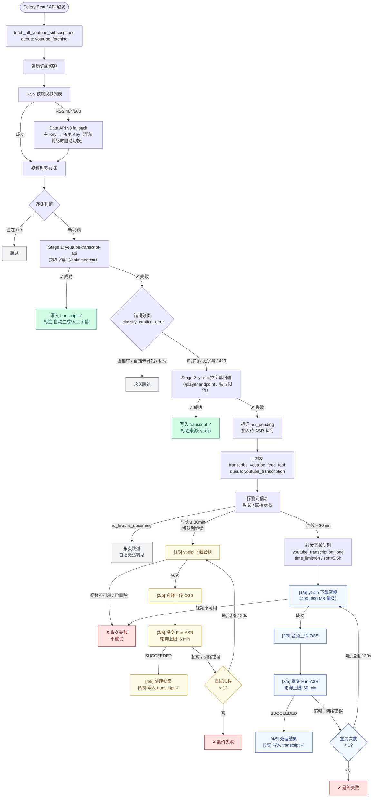
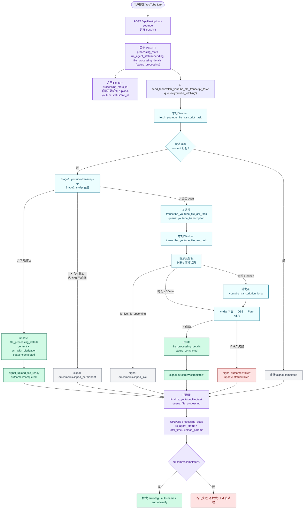

# Local Virtual Service — YouTube 转录独立 Worker

将 YouTube 视频获取、字幕拉取、yt-dlp 音频下载和 Fun-ASR 语音识别打包为**独立可部署的 Celery Worker**，部署在家庭网络虚拟机上，解决远程服务器无法直接访问 YouTube 的问题。

### 覆盖的业务入口

| 入口 | 触发方 | 主任务 | 落库目标 |
|------|--------|--------|----------|
| **YouTube Feed 订阅**（批量） | 远程 `Celery Beat` | `fetch_all_youtube_subscriptions` → `transcribe_youtube_feed_task` | `subscription_content.transcript / transcript_data` |
| **YouTube Feed 订阅**（单频道/新订阅首抓） | 远程 `/api/subscriptions` | `fetch_youtube_subscription` → `transcribe_youtube_feed_task` | 同上 |
| **Upload YouTube Link**（用户上传单条链接） | 远程 `/api/files/upload-youtube` | `fetch_youtube_file_transcript_task` → 必要时 `transcribe_youtube_file_asr_task` → 远程 `finalize_youtube_file_task` | `file_processing_details.content / asr_with_diarization` |
| **手动重转 ASR** | 远程 `POST /api/files/{file_id}/transcribe-asr` | `transcribe_youtube_file_asr_task` → 远程 `finalize_youtube_file_task` | 同上 |

> Upload Link 的终态（成功 / 永久失败）会回调远程 `finalize_youtube_file_task`（queue=`file_processing`），更新 `processing_stats.rc_agent_status`、`total_time`、`upload_params`，并在 `outcome='completed'` 时触发 auto-tag / auto-name / auto-classify。

## 架构

```
┌─────────────────────────────────────────────────────────────────┐
│                     远程服务器 (your-server-ip)                    │
│                                                                 │
│  ┌──────────────┐      ┌────────┐      ┌──────────────────┐    │
│  │ Web API       │     │ Redis  │     │   PostgreSQL      │    │
│  │ Scheduler     │     │ Broker │     │   Database        │    │
│  │               │     │        │     │                   │    │
│  │ ┌───────────┐ │     │        │     │ subscription_*    │    │
│  │ │ /upload-  │ │ ──► │        │     │ file_processing_* │    │
│  │ │  youtube  │ │     │        │     │ processing_stats  │    │
│  │ └───────────┘ │     │        │     └──────────────────┘    │
│  │ ┌───────────┐ │     │        │                               │
│  │ │ Beat /    │ │ ──► │        │      ▲                        │
│  │ │ fetch_all │ │     │        │      │ finalize_youtube_file_│
│  │ └───────────┘ │     │        │      │ task (file_processing)│
│  │               │     │        │      │                        │
│  │ file_processing ◄───┼────────┼──────┘                        │
│  └──────────────┘      └───┬────┘                               │
└──────────────────────────┼──────────────────────────────────────┘
                            │  shared broker / shared DB
   ─ ─ ─ ─ ─ ─ ─ ─ ─ ─ ─ ─ ┼ ─ ─ ─ ─ ─ ─ ─ ─ ─ ─ ─ ─ ─ ─ ─ ─ ─  公网
                            │
┌──────────────────────────┼──────────────────────────────────────┐
│                          ▼                                       │
│  ┌────────────────────────────────────────────────────────────┐ │
│  │         YouTube Transcription Worker (家庭虚拟机)            │ │
│  │                                                            │ │
│  │  ① youtube_fetching 队列                                  │ │
│  │      (Main Worker, concurrency=1)                          │ │
│  │      Feed 侧:                                              │ │
│  │        ├ fetch_all_youtube_subscriptions  (批量)            │ │
│  │        ├ fetch_youtube_subscription        (单频道/首抓)    │ │
│  │        └ fetch_youtube_transcripts_batch   (补抓)          │ │
│  │      Upload Link 侧:                                       │ │
│  │        └ fetch_youtube_file_transcript_task ◄── /upload-youtube│
│  │      共用逻辑:                                              │ │
│  │        ├ Stage1: youtube-transcript-api 字幕               │ │
│  │        ├ Stage2: yt-dlp 字幕回退（独立限流）                │ │
│  │        └ 两路均失败 → 标记 asr_pending                      │ │
│  │                        │                                   │ │
│  │                        ▼ 派发 ASR 任务                      │ │
│  │  ② youtube_transcription 队列（短视频）                     │ │
│  │      (Main Worker, concurrency=1)                          │ │
│  │      ├ transcribe_youtube_feed_task         (→ subscription_content) │
│  │      ├ transcribe_youtube_file_asr_task     (→ file_processing_details) │
│  │      ├ 探测元信息（时长 / 直播状态）                        │ │
│  │      ├ 直播 / 首播未开始 → 永久跳过                         │ │
│  │      ├ 时长 ≤ 30min:                                       │ │
│  │      │   下载音频 → OSS 上传 → Fun-ASR                      │ │
│  │      │   ASR 轮询上限: 5 min                               │ │
│  │      │   失败重试: 最多 1 次 (退避 120s)                    │ │
│  │      │   结果写回数据库 ✓                                   │ │
│  │      │   Upload Link 路径 → signal finalize ──────────────┐│ │
│  │      └ 时长 > 30min → 转发 ───────────┐                    ││ │
│  │                                        ▼                    ││ │
│  │  ③ youtube_transcription_long 队列    │                    ││ │
│  │      (Long Worker, concurrency=1)      │                    ││ │
│  │      ├ 下载音频（400–600 MB 量级）     │                    ││ │
│  │      ├ OSS 上传 → Fun-ASR              │                    ││ │
│  │      │   ASR 轮询上限: 60 min          │                    ││ │
│  │      │   失败重试: 最多 1 次 (退避 120s)│                    ││ │
│  │      └ 结果写回数据库 ✓ ◄──────────────┘                    ││ │
│  │           Upload Link 路径 → signal finalize ──────────────┘│ │
│  └────────────────────────────────────────────────────────────┘ │
│                    家庭虚拟机 (可访问 YouTube)                     │
└─────────────────────────────────────────────────────────────────┘

ASR 轮询超时对比：
  短队列 youtube_transcription      → ASR_POLL_TIMEOUT_MINUTES      = 5 min
  长队列 youtube_transcription_long → ASR_POLL_TIMEOUT_MINUTES_LONG = 60 min
  （由 tasks.py 根据当前队列名动态选择，传给 ASRService.transcribe()）

Upload Link 的 finalize 回调:
  本地 Worker 成功/永久失败后 → send_task('finalize_youtube_file_task', queue='file_processing')
  远程消费该任务 → UPDATE processing_stats + 触发 auto-tag/name/classify
```

## 流程

本 Worker 同时服务两条业务链路，字幕降级 / ASR / 长短队列路由的逻辑是共享的，区别只在**落库目标**与**完成回调**：

- **Feed 订阅链路**：`fetch_all_youtube_subscriptions` / `fetch_youtube_subscription` → 字幕 fallback → 必要时 `transcribe_youtube_feed_task` → 写 `subscription_content`。
- **Upload YouTube Link 链路**：`fetch_youtube_file_transcript_task` → 字幕 fallback → 必要时 `transcribe_youtube_file_asr_task` → 写 `file_processing_details` → 回调远程 `finalize_youtube_file_task` 触发 auto-tag/name/classify。

### Feed 订阅链路



### Upload YouTube Link 链路



### 各阶段对应的关键日志

| 阶段 | 所在队列 | 日志特征 |
|------|---------|---------|
| **[Feed]** 批量任务开始 / 结束 | `youtube_fetching` | `══ 批量获取开始/完成 ══` |
| **[Feed]** 单频道视频列表拉取 | `youtube_fetching` | `── [N/M] 频道: xxx ──`、`RSS 返回 N 个视频` 或 `Data API v3 返回 N 个视频` |
| **[Feed]** RSS → Data API v3 切换 | `youtube_fetching` | `RSS 失败, 尝试 Data API v3 fallback`；配额耗尽时追加 `Data API v3 Key #1 配额已用尽，切换备用 Key` |
| **[Feed]** 新视频字幕抓取 | `youtube_fetching` | `[新] video=xxx「title」`、`✓ 字幕获取成功: lang=xx` |
| **[Feed]** 字幕失败分类 | `youtube_fetching` | `✗ 字幕获取失败: 原因=xxx [→ ASR / 跳过]` |
| **[Feed]** ASR 降级派发 | `youtube_fetching` | `📡 派发 ASR 转录: N 个视频`、`→ ASR 任务已派发: video=xxx` |
| **[Upload]** 单链接字幕抓取开始 / 完成 | `youtube_fetching` | `── Upload Caption 开始: file_id=x video=x url=… ──`、`── Upload Caption 完成[api/ytdlp]: file_id=x lang=… 字数=… ──` |
| **[Upload]** 幂等短路 | `youtube_fetching` | `── Upload Caption 跳过: file_id=x 已完成 ──` |
| **[Upload]** 字幕永久失败 | `youtube_fetching` | `── Upload Caption 永久失败: file_id=x video=x 原因=… ──` |
| **[Upload]** ASR 降级派发 | `youtube_fetching` | `── Upload Caption 降级 ASR: file_id=x video=x 原因=… ──`、`→ File ASR 任务已派发: file_id=x video=x` |
| **[Upload]** 终态回调远程 | `youtube_fetching` / `youtube_transcription*` | `signal_upload_file_ready → finalize: file_id=x outcome=completed/failed/skipped_live/skipped_permanent` |
| 元信息探测 + 直播检测 | `youtube_transcription` | `── 直播跳过: content=x video=x live_status=x ──` / `── Upload ASR 直播跳过: file_id=x ──` |
| 长视频路由 | `youtube_transcription` | `── 长视频检测: … → 转发长视频队列 ──` / `── Upload ASR 长视频检测: file_id=x 时长=Xm 超过阈值 → 转发长视频队列 ──` |
| 音频下载 → OSS → ASR（短队列）| `youtube_transcription` | `── Feed ASR 开始/完成 ──` / `── Upload ASR 开始: file_id=x queue=youtube_transcription ──`、`[1/5]`~`[5/5]`、`ASR 任务提交: task_id=xxx` |
| 音频下载 → OSS → ASR（长队列）| `youtube_transcription_long` | 同上，`queue=youtube_transcription_long`，超时标注 `(60.0 min)` 而非 `(5.0 min)` |
| 重试 | 任意 ASR 队列 | `── Feed ASR 失败[可重试]: reason=xxx (尝试 N/2) ──` / `── Upload ASR 失败[可重试]: reason=xxx file_id=x (尝试 N/2) ──`、`→ 120s 后重试` |
| 最终失败 | 任意 ASR 队列 | `── Feed ASR 失败[永久]: reason=xxx ──` / `── Upload ASR 失败[永久]: reason=xxx file_id=x ──` |

> `youtube_fetching` 和 `youtube_transcription` 由同一个 Main Worker（concurrency=1）消费，字幕抓取和短视频 ASR 串行出现在日志里。
> `youtube_transcription_long` 由独立的 Long Worker（concurrency=1）串行处理，不会阻塞短视频。

## 消费的队列

| 队列 | 任务 | Worker | 说明 |
|------|------|--------|------|
| `youtube_fetching` | `fetch_all_youtube_subscriptions` | Main (concurrency=1) | 批量获取订阅频道视频 |
| `youtube_fetching` | `fetch_youtube_subscription` | Main | 获取单个订阅视频（含**新订阅首抓**，由 `/api/subscriptions` 在 `YOUTUBE_SUBSCRIPTION_USE_LOCAL=true` 时派发到此队列，失败累加 `consecutive_failures`） |
| `youtube_fetching` | `fetch_youtube_transcripts_batch` | Main | 批量拉取字幕，失败自动派发 ASR |
| `youtube_fetching` | `fetch_youtube_file_transcript_task` | Main | **Upload YouTube Link** 字幕抓取（由 `/api/files/upload-youtube` 在 `YOUTUBE_UPLOAD_USE_LOCAL=true` 时派发）；落库到 `file_processing_details.content / asr_with_diarization`，无字幕或被封时自动派发 `transcribe_youtube_file_asr_task` |
| `youtube_transcription` | `transcribe_youtube_feed_task` | Main | Feed 短视频 Fun-ASR 转录（进入后探测时长，>30min 自动转发长队列）|
| `youtube_transcription` | `transcribe_youtube_file_asr_task` | Main | 用户上传链接视频 Fun-ASR 转录（**与 Feed 对齐**：支持直播永久失败 + 长视频自动路由 + 成功/永久失败回调远程 `finalize_youtube_file_task`）|
| `youtube_transcription_long` | `transcribe_youtube_feed_task` / `transcribe_youtube_file_asr_task` | Long (concurrency=1) | 长视频专用，防止大文件阻塞主 worker |

### 远程回调任务（Upload Link 链路）

Upload YouTube Link 终态（成功或永久失败）由本地 Worker 通过 `ContentStore.signal_upload_file_ready` 把 `finalize_youtube_file_task` 消息投递到远程 `file_processing` 队列。远程回调负责：

1. 更新 `processing_stats.rc_agent_status / total_time / upload_params`；
2. 仅在 `outcome='completed'` 时触发 auto-tag / auto-name / auto-classify。

### 长视频自动路由

`transcribe_youtube_feed_task` 在主 worker 执行时会调用 `yt-dlp` 仅拉取元信息（不下载）探测时长，超过阈值立即 re-queue 到 `youtube_transcription_long`，长视频 worker 单独慢慢处理。`transcribe_youtube_file_asr_task` 采用完全一致的 probe + 转发策略。

| 场景 | 举例 | 走向 |
|------|------|------|
| 普通视频 | 5 min 新闻短片 | 主 worker（同以往）|
| 长视频 | 10 min+ 深度访谈 | 主 worker 探测 → 转长队列 → 长 worker 处理 |
| 超长直播 | 11 h 直播回放（Fun-ASR 上限 12h）| 主 worker 探测 → 转长队列 → 长 worker 单独跑，不卡其他任务 |

阈值通过环境变量 `ASR_LONG_VIDEO_THRESHOLD_SECONDS` 配置（默认 `1800`，即 30 分钟）。

## 与主项目的区别

- **完全独立** — 不依赖 `backend/` 目录，可单独复制部署
- **零冗余** — 仅包含 YouTube/ASR 相关代码，不加载其他 40+ 任务
- **任务名兼容** — 任务名称与主项目一致，服务器 dispatch 后本 Worker 直接消费

## 快速部署

```bash
# 需要已安装 Miniconda/Anaconda
bash setup.sh

# 编辑配置
nano ~/local_virtual_service/.env
```

### 升级已部署的环境（增加 curl-cffi 依赖）

如果你是从旧版升级过来，需要额外安装 `curl-cffi` 以支持 yt-dlp 的 TLS 指纹伪装（绕过 YouTube 字幕 CDN 的 429）：

```bash
# 路径按你实际的 conda 环境调整
# 注意版本上限！yt-dlp 只兼容 curl-cffi 0.10.x ~ 0.14.x（以及 0.5.10），
# 装了 0.15+ 会报 ImportError 导致 impersonation 不可用
/root/miniconda3/envs/yt_service/bin/pip install "curl-cffi>=0.10,<0.15"

# 验证 yt-dlp 真的识别到了 impersonate 后端（应输出一串非空列表）
/root/miniconda3/envs/yt_service/bin/python -c \
  "import yt_dlp; y=yt_dlp.YoutubeDL({'quiet':True}); \
   print([str(t) for t in y._get_available_impersonate_targets()])"
```

安装后 `.env` 里 `YTDLP_IMPERSONATE=auto` 自动生效。如果不想启用，设置 `YTDLP_IMPERSONATE=false`。

### 如果已装了太新版本（> 0.14）怎么办

降级即可：

```bash
/root/miniconda3/envs/yt_service/bin/pip install "curl-cffi>=0.10,<0.15"
```

pip 会自动卸载旧版装兼容版，不需要手动 uninstall。

## 启动

```bash
# 前台运行（直接查看日志，适合调试）
bash /opt/local_virtual_service/start.sh

# 后台运行（日志写入文件）
nohup bash /opt/local_virtual_service/start.sh > /opt/local_virtual_service/logs/worker.log 2>&1 &

# 查看后台日志
tail -f /opt/local_virtual_service/logs/worker.log
```

## 重启

```bash
# 停止旧进程
pkill -f "celery -A worker.celery_app"

# 等待进程退出后重新后台启动
sleep 2 && nohup bash /opt/local_virtual_service/start.sh > /opt/local_virtual_service/logs/worker.log 2>&1 &

# 确认新进程已就绪
ps aux | grep "celery -A worker.celery_app" | grep -v grep
```


## 查看日志
```bash
tail -f /opt/local_virtual_service/logs/worker.log
```

## 字幕获取与 ASR 自动降级

> 本节描述的降级链路被 **Feed 订阅**和 **Upload YouTube Link** 两条业务共用，唯一区别是落库表：Feed 写 `subscription_content.transcript / transcript_data`，Upload 写 `file_processing_details.content / asr_with_diarization` 并额外回调远程 `finalize_youtube_file_task`。

字幕获取有两条独立路径，失败后再降级到 ASR，最大化成功率：

```
新视频入库
  │
  ├─ Stage 1: youtube-transcript-api 拉取字幕（走 /api/timedtext endpoint）
  │    │
  │    ├─ 成功 → transcript 写入 DB ✓[API]
  │    │
  │    ├─ 永久失败（直播未开始 / 首播未开始 / 私有视频）→ 跳过
  │    │
  │    └─ 瞬时失败（IP 封锁 / 无字幕 / 429）
  │         │
  │         ▼
  ├─ Stage 2: yt-dlp 拉字幕（走 player endpoint，被独立限流）
  │    │
  │    ├─ 成功 → transcript 写入 DB ✓[yt-dlp]（API→原因 附在日志里）
  │    │
  │    └─ 失败
  │         │
  │         ▼
  └─ Stage 3: 派发到 Fun-ASR 语音识别（ASR 队列，下载音频 → OSS → 转录）
       │
       └─ 成功 → transcript 写入 DB ✓[ASR]
```

两条字幕路径的关键区别：

| 路径 | Endpoint | 被风控的独立性 | 延迟 |
|------|----------|----------------|------|
| transcript-api | `/api/timedtext` | 批量请求秒封，IP 信誉墙严格 | ~1s |
| yt-dlp | `/watch` + `/player_api` | 容忍度高，伪装成正常播放器 | ~3-5s |

当出口 IP 在 transcript-api 上被封时，yt-dlp 路径通常仍可用，能显著降低 ASR 调用率。可通过 `CAPTION_YTDLP_FALLBACK_ENABLED=false` 禁用 fallback。

### 启用 Webshare 住宅代理给 transcript-api（IP 被封时的根治方案）

当出口 IP 被 YouTube **批量封禁** transcript-api（典型表现：同一频道里几乎所有视频都拿不到字幕，全部降级到 ASR，OSS 上行被打爆），yt-dlp fallback 只能缓解；要根治需要让 transcript-api 走旋转住宅代理。本服务**只代理这一条链路**，所以单视频流量极小（5–50 KB），按 Webshare 最低档 $3.50/月/1 GB 套餐，足够每天处理几千条视频。

#### 设计边界（重要）

| 链路 | 流量级别 | 是否走 Webshare |
|------|---------|----------------|
| `youtube-transcript-api` → `/api/timedtext` | KB | ✅ 走 |
| `yt-dlp` 字幕 fallback → `/watch` + `/player_api` | 几百 KB | ❌ 不走 |
| `yt-dlp` 音频下载 | **MB ~ 数百 MB** | ❌ 不走（这正是关键） |
| `oss2` SDK 上传到阿里云 OSS | 与音频同量级 | ❌ 不走 |
| `dashscope` 提交 Fun-ASR | KB | ❌ 不走 |

代理范围**写死在代码里**（`YouTubeCaptionService._get_webshare_proxy_config()` 只把 `WebshareProxyConfig` 对象传给 `YouTubeTranscriptApi`），所以**只要不手动 `export HTTPS_PROXY=...`，就不会有任何额外计费流量泄漏**。

#### 启用步骤

1. 在 [Webshare Dashboard](https://dashboard.webshare.io/) 注册并购买 **Rotating Residential** 套餐（最小 1 GB / $3.50/月即可，**不要**买 "Proxy Server" 或 "Static Residential"）。
2. 在 [Proxy Settings](https://dashboard.webshare.io/proxy/settings) 复制 Proxy Username / Password。
3. 编辑家庭 VM 上的 `~/local_virtual_service/.env`，添加：
   ```bash
   WEBSHARE_PROXY_USERNAME=<your-username>
   WEBSHARE_PROXY_PASSWORD=<your-password>
   # 出口国家白名单（逗号分隔），HK/CN 服务器推荐 jp,tw,sg；可省略 = 全球池
   WEBSHARE_FILTER_IP_LOCATIONS=jp,tw,us
   ```
4. 重启 worker：
   ```bash
   pkill -f "celery -A worker.celery_app"
   sleep 2 && nohup bash /opt/local_virtual_service/start.sh > /opt/local_virtual_service/logs/worker.log 2>&1 &
   ```
5. 确认日志里出现一行启动提示：
   ```
   ✓ youtube-transcript-api 已启用 Webshare 住宅代理 (locations=['jp','tw','us'])
   ```

不填这两个变量则维持原来的直连行为，零流量、零成本，可以随时切回。

#### 何时不需要

- 出口 IP 干净、字幕成功率 > 80%：完全不需要，开了反而增加每条视频几百毫秒延迟；
- 已经迁移到日本/新加坡的小众机房 VPS：先观察一周，没被 ban 就别开。

#### 何时强烈建议开

- 日志里出现 `✗ 字幕获取失败: 原因=IpBlocked`、`RequestBlocked`、`Too Many Requests` 占比 > 30%；
- ASR 队列莫名暴涨、OSS 上行被打满（你正在经历的情况）；
- 同一频道连续 5+ 条视频都是 `[→ ASR]`，但视频本身明明有字幕（手动在 YouTube 网页上能看到）。

## 日志输出示例

前台运行时日志直接输出到终端，后台运行时写入 `logs/worker.log`。

**批量订阅获取 + 自动 ASR 降级**：
```
══════════════════════════════════════════════════
  批量获取开始: 31 个订阅, 26 个频道
══════════════════════════════════════════════════
── [1/26] 频道: Bloomberg Television (UCIALMKvObZNtJ6AmdCLP7Lg) ──
  RSS 返回 15 个视频
  [新] video=FLmZ6HnOSkE「Trump Tariff Pause Sends Markets Higher」
  ✓ 字幕获取成功: video=FLmZ6HnOSkE lang=en 字数=5230
  ✗ 字幕获取失败: video=zkHFpVXoLdA 原因=IP 被 YouTube 封锁 [→ ASR]
  ✗ 字幕获取失败: video=51WGag3jPKg 原因=直播未开始 [跳过]
  小计: 新增=3 已有=12 字幕成功=1 待ASR=1
  ...
══════════════════════════════════════════════════
  批量获取完成 (23142 ms)
  频道: 成功=26 / 总计=26
  视频: 新增=5 已有=379
  字幕: 成功=2 / 新增=5
  ASR:  派发=3
══════════════════════════════════════════════════
  📡 派发 ASR 转录: 3 个视频
    → ASR 任务已派发: video=zkHFpVXoLdA content=1234
    → ASR 任务已派发: video=RRwO9QOi8c8 content=1235
    → ASR 任务已派发: video=gNC5_2K8bn8 content=1236

── Feed ASR 开始: content=1234 video=zkHFpVXoLdA ──
  [1/5] yt-dlp 下载音频...
  [2/5] 音频下载完成: 12.3 MB (youtube_zkHFpVXoLdA.mp3)
  [3/5] 上传到 OSS...
  [4/5] 提交 Fun-ASR 转录...
  [5/5] 处理 ASR 结果...
── Feed ASR 完成: content=1234 video=zkHFpVXoLdA 字数=8520 ──
```

## 依赖的外部服务

| 服务 | 环境变量 | 必需 | 说明 |
|------|----------|------|------|
| Redis | `REDIS_URL` | 是 | Celery Broker |
| PostgreSQL | `DB_HOST` 等 | 是 | 数据存储 |
| 阿里云 OSS | `OSS_ACCESS_KEY_ID` 等 | ASR 时 | 音频中转 |
| DashScope | `DASHSCOPE_API_KEY` | ASR 时 | Fun-ASR 引擎 |
| YouTube Data API（主 Key） | `YOUTUBE_DATA_API_KEY` | 强烈建议 | RSS 成功率极低，Data API v3 已成为主力获取路径 |
| YouTube Data API（备用 Key） | `YOUTUBE_DATA_API_KEY_BACKUP` | 否 | 主 Key 配额（10,000 units/天）耗尽时自动切换；每个 Key 约可查询 100 个频道/天 |

## 可调环境变量

所有参数都在 `.env` 里，分为 8 个分区。修改后重启 worker 生效（`pkill -f celery && nohup bash start.sh ...`）。

### 三、Worker 资源

| 变量 | 默认值 | 说明 |
|------|--------|------|
| `WORKER_MAIN_CONCURRENCY` | `1` | 主 worker 并发数（短视频 + 抓取）。**默认从 2 降到 1** —— 家用宽带上行通常 10–50 Mbps，并发 2 时两条 OSS 上传会互抢带宽（日志里能看到 0.8 MB 文件传 5 分钟、`ReadTimeout` 等典型症状）。串行更稳。迁移到云 VPS 或上行 ≥100 Mbps 后可调回 2–4 |
| `WORKER_LONG_CONCURRENCY` | `1` | 长视频 worker 并发数。家庭网络下不要升到 2，单条长视频就能吃满整个上行 |
| `WORKER_MAIN_MAX_TASKS_PER_CHILD` | `20` | 子进程处理 N 个任务后重启（防内存泄漏）|
| `WORKER_LONG_MAX_TASKS_PER_CHILD` | `10` | 同上，长 worker 任务更重，更频繁重启 |
| `WORKER_LOG_LEVEL` | `info` | celery 日志级别：debug / info / warning / error |

### 四、Celery 任务超时（全局默认）

| 变量 | 默认值 | 说明 |
|------|--------|------|
| `TASK_TIME_LIMIT_SECONDS` | `7200`（2h）| 全局硬超时 |
| `TASK_SOFT_TIME_LIMIT_SECONDS` | `6600`（1h50m）| 全局软超时，业务层可 catch |
| `RESULT_EXPIRES_SECONDS` | `3600`（1h）| 任务结果在 Redis 中保留时长 |

### 五、长视频队列路由 & 超时

| 变量 | 默认值 | 说明 |
|------|--------|------|
| `ASR_LONG_VIDEO_THRESHOLD_SECONDS` | `1800`（30min）| 超过此时长自动转发到 `youtube_transcription_long` |
| `ASR_LONG_TASK_TIME_LIMIT_SECONDS` | `21600`（6h）| 长视频任务的 **硬**超时，覆盖全局 2h |
| `ASR_LONG_TASK_SOFT_TIME_LIMIT_SECONDS` | `19800`（5.5h）| 长视频任务的 **软**超时 |

### 六、失败重试策略

| 变量 | 默认值 | 说明 |
|------|--------|------|
| `ASR_MAX_RETRIES` | `1` | 瞬时错误最多重试次数（永久错误立即失败不重试）|
| `ASR_RETRY_BACKOFF_BASE_SECONDS` | `120` | 指数退避基准，`countdown = base × 2^n` |
| `ASR_RETRY_BACKOFF_MAX_SECONDS` | `600` | 单次重试最长等待时间 |

> **为什么 MAX_RETRIES=1**：ASR 超时的根因是本地轮询等待时间不足（不是 Fun-ASR 真的失败）。
> 每次重试都会重新下载 400–600 MB 音频 + 重新上传 OSS + 重新提交 ASR，浪费巨大。
> 将轮询上限调大（`ASR_POLL_TIMEOUT_MINUTES_LONG=60`）让首次就能跑完，比多次重试更高效。

#### 错误分类

| 类别 | 示例 | 行为 |
|------|------|------|
| 🔴 永久失败 | 视频不可用 / 私有 / 年龄限制 / 会员专属 / 视频已删除 / ASR 无人声 / OSS 权限拒绝 / 服务未配置 | **立即标记 failed，不重试** |
| 🟡 瞬时失败 | 软超时 / 429 / 502 / 503 / 网络超时 / 连接重置 / yt-dlp 未产出文件 | **指数退避重试**（120s → 240s，最多 1 次）|
| ⚪ 未分类异常 | 其他未覆盖的异常 | 保守策略：**走重试流程** |

### 七、外部服务超时

| 变量 | 默认值 | 说明 |
|------|--------|------|
| `YTDLP_SOCKET_TIMEOUT_SECONDS` | `30` | yt-dlp 单个 socket 操作超时 |
| `YTDLP_RETRIES` | `5` | yt-dlp 顶层请求重试次数 |
| `YTDLP_FRAGMENT_RETRIES` | `5` | yt-dlp 分片下载重试次数 |
| `YTDLP_IMPERSONATE` | `auto` | TLS 指纹伪装（**需装 `curl-cffi`**）。推荐 `auto`（yt-dlp 自选可用 target）；也支持 `chrome`/`safari`/`edge`/`firefox`（不可用时自动降级为 auto），或 `false` 禁用 |
| `YOUTUBE_FEED_TIMEOUT_SECONDS` | `5` | RSS / Data API 单次请求超时 |
| `YOUTUBE_FEED_MAX_RETRIES` | `2` | RSS **5xx 瞬时错误**的最大尝试次数（含首次），即重试 1 次。**404 不重试**——YouTube RSS 对部分频道/IP 固定返回 404，重试无效且浪费时间，直接 fallback 到 Data API v3 |
| `YOUTUBE_TRANSCRIPT_TIMEOUT_SECONDS` | `60` | youtube-transcript-api 硬超时。启用 Webshare 后每次请求最多触发 10 次 IP 旋转重试，默认值已预留该开销；纯直连场景可降回 `30` |
| `CAPTION_YTDLP_FALLBACK_ENABLED` | `true` | transcript-api 失败时是否用 yt-dlp 再试一次 |
| `CAPTION_YTDLP_TIMEOUT_SECONDS` | `60` | yt-dlp 拉字幕总超时（元信息 + 字幕下载）|
| `CAPTION_YTDLP_SLEEP_SUBTITLES_SECONDS` | `0.5` | 每次字幕下载前睡眠秒数（yt-dlp `--sleep-subtitles`）|
| `CAPTION_YTDLP_SLEEP_REQUESTS_SECONDS` | `0.5` | 元信息提取期间每次请求间睡眠（yt-dlp `--sleep-requests`）|
| `ASR_POLL_TIMEOUT_MINUTES` | `5` | Fun-ASR 轮询上限（短队列 `youtube_transcription` 使用）|
| `ASR_POLL_TIMEOUT_MINUTES_LONG` | `60` | Fun-ASR 轮询上限（长队列 `youtube_transcription_long` 使用）。≤3h 视频 Fun-ASR 典型耗时 10–25 min，60 min 有充足余量 |
| `OSS_SIGNED_URL_TTL_SECONDS` | `172800`（48h）| OSS 签名 URL 有效期 |

### 其他

| 变量 | 默认值 | 说明 |
|------|--------|------|
| `YOUTUBE_DATA_API_KEY` | — | YouTube Data API v3 主 Key（RSS 成功率极低，此 Key 已成为主力；强烈建议配置）|
| `YOUTUBE_DATA_API_KEY_BACKUP` | — | YouTube Data API v3 备用 Key，主 Key HTTP 403（配额耗尽）时自动切换；日志中可见 `Data API v3 Key #1 配额已用尽，切换备用 Key` |
| `YOUTUBE_PROXY` / `HTTPS_PROXY` | — | yt-dlp / RSS / 探测时长 统一走此代理 (**注意**：此变量**不会**作用于 youtube-transcript-api，那条链路独立用 `WEBSHARE_*` 配置) |
| `YOUTUBE_COOKIES_FILE` | — | 用于绕过 YouTube 的风控 |
| `YOUTUBE_PO_TOKEN` + `YOUTUBE_VISITOR_DATA` | — | yt-dlp PO token 机制 |
| `WEBSHARE_PROXY_USERNAME` | — | Webshare Rotating Residential 用户名，**仅作用于 youtube-transcript-api** |
| `WEBSHARE_PROXY_PASSWORD` | — | Webshare Rotating Residential 密码，与上一条配对生效；缺一个 = 走直连 |
| `WEBSHARE_FILTER_IP_LOCATIONS` | — | 限定代理出口国家，逗号分隔的 ISO-3166 二字码（如 `jp,tw,us`）。留空 = 全球池 |

### 常见调参场景

| 场景 | 建议调整 |
|------|---------|
| CPU 利用率低，想提升吞吐 | `WORKER_MAIN_CONCURRENCY` 调到 3-4 |
| Upload Link 用户并发多、Feed 批量任务被饿死 | `WORKER_MAIN_CONCURRENCY` 调到 3-4；必要时为 Upload 单独建专属 worker 只消费 `youtube_fetching` |
| 长视频积压严重 | `WORKER_LONG_CONCURRENCY` 调到 2 |
| 网络经常抖动 | `YTDLP_SOCKET_TIMEOUT_SECONDS` 60+，`YOUTUBE_FEED_TIMEOUT_SECONDS` 10+ |
| YouTube 风控严重 | `YOUTUBE_TRANSCRIPT_TIMEOUT_SECONDS` 60，配合 `YOUTUBE_COOKIES_FILE` |
| transcript-api 出口 IP 被批量封 | 配置 `WEBSHARE_PROXY_USERNAME` / `WEBSHARE_PROXY_PASSWORD`（详见上文 [Webshare 一节](#启用-webshare-住宅代理给-transcript-api-ip-被封时的根治方案)）|
| 家用宽带上行 < 50 Mbps，OSS 频繁 ReadTimeout | `WORKER_MAIN_CONCURRENCY=1` 串行处理，避免两个 OSS 上传互抢带宽 |
| RSS 持续 404 / Data API v3 配额告急 | 配置 `YOUTUBE_DATA_API_KEY_BACKUP`；或降低批量抓取频率（每个 Key 约可查 100 频道/天）|
| 长视频 Fun-ASR 排队严重（>1h）| `ASR_POLL_TIMEOUT_MINUTES_LONG` 调到 90-120 |
| 短视频 Fun-ASR 超时 | `ASR_POLL_TIMEOUT_MINUTES` 调到 10-15 |
| 想临时禁用重试排错 | `ASR_MAX_RETRIES=0` |
| 有 > 12h 的超长直播 | `ASR_LONG_TASK_TIME_LIMIT_SECONDS=43200`（Fun-ASR 上限）|

## 服务器端配置

需要在服务器的 `backend/celery_config.py` 中将 YouTube 相关任务路由到对应队列（已更新）：

```python
'fetch_youtube_subscription': {'queue': 'youtube_fetching'},
'fetch_all_youtube_subscriptions': {'queue': 'youtube_fetching'},
'fetch_youtube_transcripts_batch': {'queue': 'youtube_fetching'},
'fetch_youtube_file_transcript_task': {'queue': 'youtube_fetching'},   # Upload Link 字幕抓取
'transcribe_youtube_feed_task': {'queue': 'youtube_transcription'},
'transcribe_youtube_file_asr_task': {'queue': 'youtube_transcription'},
'finalize_youtube_file_task': {'queue': 'file_processing'},            # Upload Link 完成回调（远程）
```

### ⚠ 远端 Worker 的 task time_limit 实际受主项目 stub 控制

Celery 会把调用侧 `@task(time_limit=..., soft_time_limit=...)` **作为消息头**随任务发到远端 Worker，
**压过**本地 `celery_app.py` 里配置的 `TASK_TIME_LIMIT_SECONDS` 默认值。因此跑在 HK 家用 Worker 上的
下面两个任务，实际生效的是**主项目** `backend/tasks/subscription_tasks.py` 里装饰器上的数字：

| 任务名 | 主项目 stub 位置 | 当前 time_limit / soft | 为什么这么大 |
|--------|------------------|------------------------|--------------|
| `fetch_all_youtube_subscriptions` | `fetch_all_youtube_subscriptions_task` | 4200 / 3600（70 / 60 min）| concurrency=1 + Webshare 串行处理 20 频道 × ~15 视频，实测整批 30–60 min |
| `fetch_youtube_transcripts_batch` | `fetch_youtube_transcripts_batch_task` | 2400 / 2100（40 / 35 min）| 补抓 ~150 视频，每项 Webshare 路径 5–30s |

下次若在 HK 日志里看到 `Soft time limit (XXXs) exceeded for fetch_all_youtube_subscriptions`
然后 worker 被 `SIGKILL`，第一时间检查**主项目**这两个装饰器而不是 HK 的 `.env`。

### 灰度开关（服务器端环境变量）

| 变量 | 默认 | 说明 |
|------|------|------|
| `YOUTUBE_UPLOAD_USE_LOCAL` | `true` | `/api/files/upload-youtube` 是否走新本地路径。`false` 走远程遗留 `upload_and_process_youtube_task`（紧急回滚用）|
| `YOUTUBE_SUBSCRIPTION_USE_LOCAL` | `true` | 新订阅首抓是否走本地队列。`false` 走远程遗留派发器（自动再派到本地）|

---

## 代码仓库管理

本目录（`deployment/local_virtual_service`）的代码同时维护在两个 Git 仓库中：

| 仓库 | 用途 |
|------|------|
| [guanhetech](https://github.com/solterra2888/guanhetech) | 主仓库，包含完整项目 |
| [LocalVirtualService](https://github.com/solterra2888/LocalVirtualService) | 独立仓库，仅含本目录内容 |

### 首次推送（已完成）

```bash
# 在 guanhetech 根目录执行
git remote add local-virtual-service https://github.com/solterra2888/LocalVirtualService.git
git subtree split --prefix=deployment/local_virtual_service -b lvs-temp
git -c http.version=HTTP/1.1 push local-virtual-service lvs-temp:main
git branch -D lvs-temp
```

### 日常更新推送

每次本目录有新提交后，在 `guanhetech` 根目录执行：

```bash
git -c http.version=HTTP/1.1 subtree push --prefix=deployment/local_virtual_service local-virtual-service main
```

> 若出现 `Updates were rejected`（subtree 历史不兼容），改用强制推送：
>
> ```bash
> git subtree split --prefix=deployment/local_virtual_service -b lvs-temp
> git -c http.version=HTTP/1.1 push local-virtual-service lvs-temp:main --force
> git branch -D lvs-temp
> ```

### 说明

- 使用 `-c http.version=HTTP/1.1` 是为了绕过国内网络环境下常见的 HTTP/2 帧层错误。
- `git subtree` 会自动将 `deployment/local_virtual_service` 子目录的提交历史完整同步到 `LocalVirtualService` 仓库，无需手动维护两份代码。
